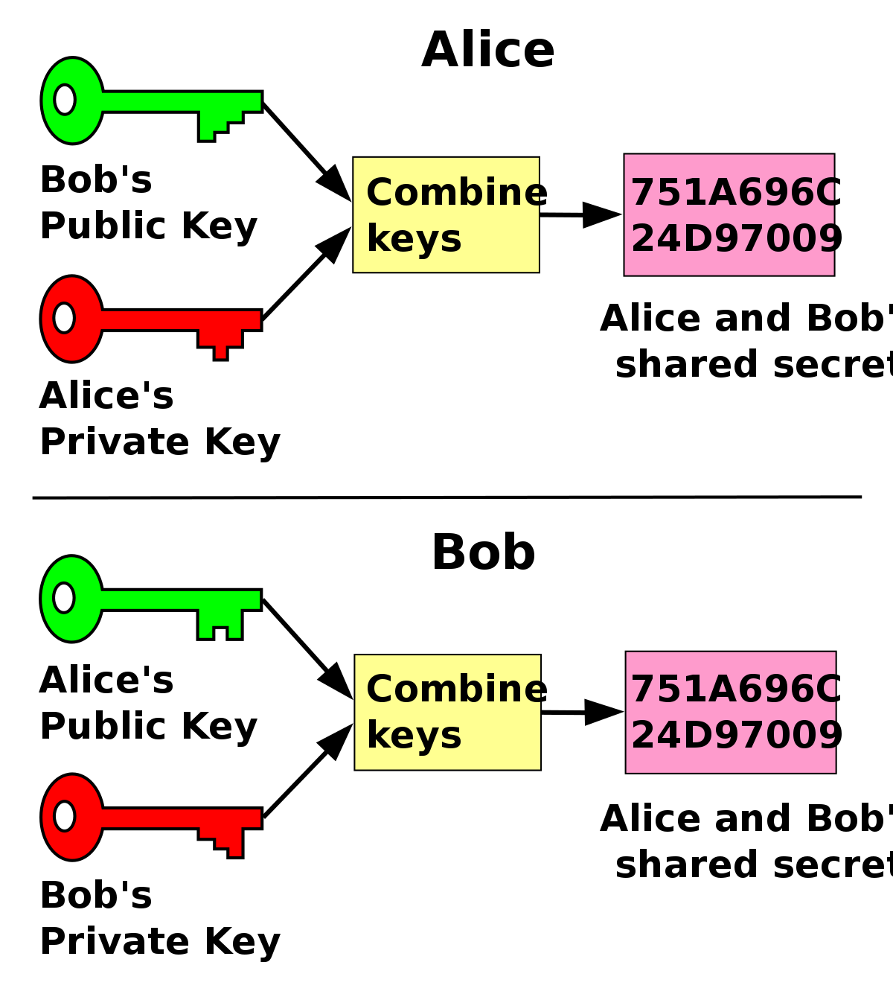

# Aplicación de Intercambio de Claves Diffie-Hellman

Esta es una aplicación cliente-servidor que implementa el algoritmo de intercambio de claves Diffie-Hellman. 

El objetivo de esta aplicación es permitir que dos partes, el cliente y el servidor, establezcan una clave compartida de forma segura, incluso si la comunicación entre ellas es interceptada por un tercero.

## Imagen

## Características

- Utiliza sockets para permitir la comunicación entre el cliente y el servidor.
- El servidor genera valores aleatorios de p y g, que son compartidos con el cliente para establecer un grupo de claves.
- Ambas partes generan claves privadas y públicas, y las intercambian.
- Luego, se calcula la clave compartida de forma segura utilizando los valores públicos de la otra parte.
- La clave compartida resultante se muestra tanto en el servidor como en el cliente.

## Instrucciones de Uso

- Ejecute el servidor **server.py**
- Ejecute el cliente **client.py** en una terminal diferente.
- La aplicación cliente-servidor se comunicará y realizará el intercambio de claves Diffie-Hellman.
- La clave compartida se mostrará tanto en el servidor como en el cliente.

###  Notas

Puede personalizar los valores de client_private_key y server_private_key en el archivo del cliente para simular diferentes claves privadas.

